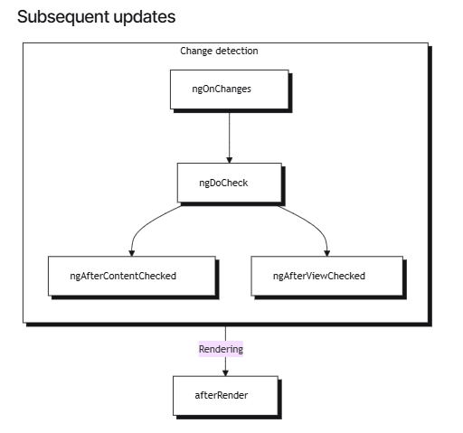

## Lifecycle Hooks

The component lifecycle hooks are methods that are called at different points in a component's life. These methods can be used to perform a wide range of tasks such as setting up and tearing down resources, performing initialization and cleanup, and responding to changes in the component's inputs.

Here is an overview of the component lifecycle hooks and when they are called:

- **ngOnChanges()**: When the component's inputs change, the ngOnChanges() lifecycle hook is called. This hook is called after the default change detector checks the component's inputs and finds that one or more of them have changed.
- **ngOnInit()**: After the constructor, the ngOnInit() lifecycle hook is called. This hook is called after the first ngOnChanges(), and is called only once.
- **ngDoCheck()**: Called during every change detection run, immediately after ngOnChanges() and ngOnInit(). Use this hook to implement custom change detection when Angular's default change detection doesn't catch the changes you need to act on.
- **ngAfterContentInit()**: After the component's content has been fully initialized, the ngAfterContentInit() lifecycle hook is called. This hook is called after the component's content has been projected into the component's view.
- **ngAfterContentChecked()**: Called after ngAfterContentInit() and every subsequent ngDoCheck(). This hook is useful when you need to do something after Angular checks the content projected into the component.
- **ngAfterViewInit()**: After the component's view has been fully initialized, the ngAfterViewInit() lifecycle hook is called. This hook is called after the component's view has been fully initialized and after the ngAfterContentInit() hook has been called.
- **ngAfterViewChecked()**: After the component's view has been fully initialized and after the ngAfterViewInit() lifecycle hook has been called, the ngAfterViewChecked() lifecycle hook is called. This hook is called after every change detector check, and is called repeatedly.
- **ngOnDestroy()**: When the component is destroyed, the ngOnDestroy() lifecycle hook is called. This hook is called before the component is destroyed and is called only once.

These lifecycle hooks can be used to perform a wide range of tasks such as setting up and tearing down resources, performing initialization and cleanup, and responding to changes in the component's inputs.

## Execution Order

### During Initialization

### Updates 

